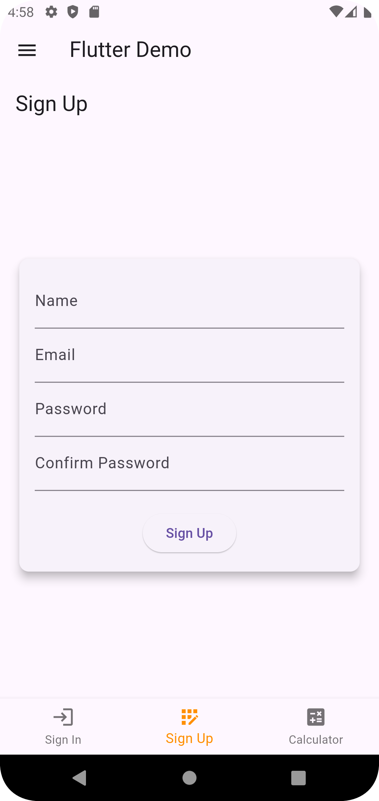
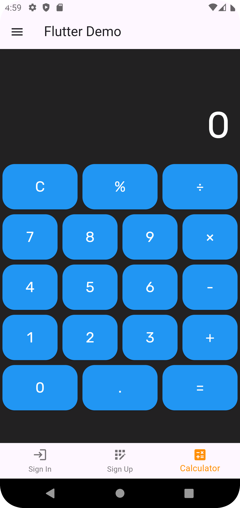
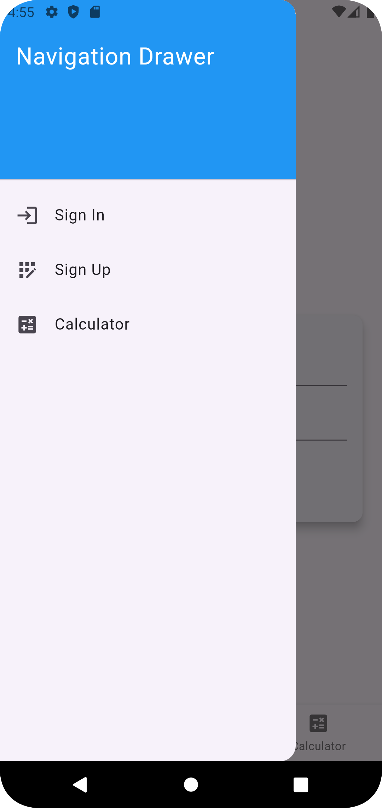

# Flutter App with SignIn, SignUp, Calculator, and Drawer

This Flutter application features a simple and intuitive user interface with the following screens:
- **SignIn**
- **SignUp**
- **Calculator**
- **Navigation Drawer**

## Features

1. **SignIn Screen**
    - Users can sign in with their email and password.
    - Includes animations for a smooth user experience.

2. **SignUp Screen**
    - Users can sign up with their name, email, password, and confirm their password.
    - Includes animations for a smooth user experience.

3. **Calculator Screen**
    - Basic calculator functionality with a clean UI.

4. **Navigation Drawer**
    - A slide-out navigation drawer with a hamburger menu icon.
    - Allows navigation between different screens.
    - Customizable appearance with icons and styling.

## Screenshots

### SignIn Screen


### SignUp Screen


### Calculator Screen


### Navigation Drawer


## Getting Started

To get started with this project, follow the instructions below:

### Prerequisites

- [Flutter](https://flutter.dev/docs/get-started/install)
- [Dart](https://dart.dev/get-dart)
- A code editor like [Visual Studio Code](https://code.visualstudio.com/) or [Android Studio](https://developer.android.com/studio)

### Installation

1. **Clone the repository:**
   ```bash
   git clone https://github.com/yourusername/your-repo-name.git
